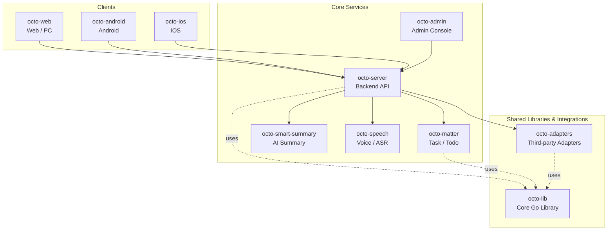

<p align="center">
  <b>octo-speech — Intelligent speech-to-text microservice for OCTO</b>
</p>

<p align="center">
  <a href="https://github.com/Mininglamp-OSS"><b>🏠 OCTO Home</b></a> ·
  <a href="#-quick-start"><b>🚀 Quick Start</b></a> ·
  <a href="#-octo-ecosystem"><b>📦 Ecosystem</b></a> ·
  <a href="./CONTRIBUTING.md"><b>🤝 Contributing</b></a>
</p>

<p align="center">
  <a href="./LICENSE"></a>
  <a href="./README.zh.md"></a>
</p>

---

> 🌐 **Read in**: **English** · [简体中文](README.zh.md)

# octo-speech

> **Multi-engine ASR microservice for OCTO** — context-aware transcription, vocabulary management, and a standalone admin console. Plugs into any OCTO deployment as a first-class voice input layer.

`octo-speech` delivers speech-to-text capabilities to the OCTO platform. It supports multiple LLM-backed ASR engines (Gemini, GPT, Qwen) with automatic failover, vocabulary correction profiles scoped per user/space/org, and an independent admin service for app and API key lifecycle management.

## 🌟 Why octo-speech

- **Engine-agnostic.** Gemini, GPT, and Qwen backends with automatic failover — swap or add engines without touching callers.
- **Context-aware correction.** Vocabulary profiles scoped per user, space, and org turn raw transcripts into accurate, domain-specific text.
- **Zero shared-secret exposure.** API keys are stored as SHA-256 hashes; the plaintext is shown exactly once on creation and never persisted.
- **Independent admin surface.** A dedicated admin service (port 8781) handles app CRUD and key management — isolated from the transcription path.
- **Security-first defaults.** JWT in httpOnly + SameSite=Strict cookies, CSRF double-submit, login rate limiting, non-root container runtime.

## 🚀 Quick Start

### Prerequisites

- Docker & Docker Compose
- MySQL 8.0+

### 1. Clone

```bash
git clone https://github.com/Mininglamp-OSS/octo-speech.git
cd octo-speech
```

### 2. Configure

Create a `.env` file:

```env
# MySQL
MYSQL_ROOT_PASSWORD=your_password

# Speech Service
SPEECH_DB_DSN=root:your_password@tcp(mysql:3306)/octo_speech?parseTime=true&loc=Asia%2FShanghai
VOICE_LITELLM_URL=https://your-llm-gateway/v1
VOICE_LITELLM_KEY=sk-xxx
VOICE_ENGINE=gemini

# Admin Service
ADMIN_USERNAME=admin
ADMIN_PASSWORD=your_admin_password
ADMIN_JWT_SECRET=your_secret_here
ADMIN_SECURE_COOKIE=false   # set true behind HTTPS
```

### 3. Deploy

```bash
# Build images
docker build -t octo-speech:latest .
docker build -f Dockerfile.admin -t octo-speech-admin:latest .

# Run
docker compose up -d
```

### 4. Create Your First App

Open `http://localhost:8781` → Login → Create App → Copy the API key (shown only once).

### Local Development

```bash
# Run tests
go test ./...

# Build binaries
go build -o speech ./cmd/speech
go build -o admin ./cmd/admin

# Run speech service
SPEECH_DB_DSN="root:pass@tcp(localhost:3306)/octo_speech?parseTime=true" \
VOICE_LITELLM_URL="http://localhost:4000/v1" \
VOICE_LITELLM_KEY="sk-xxx" \
./speech

# Run admin service
SPEECH_DB_DSN="root:pass@tcp(localhost:3306)/octo_speech?parseTime=true" \
ADMIN_USERNAME=admin \
ADMIN_PASSWORD=dev123 \
ADMIN_SECURE_COOKIE=false \
./admin
```

## 📐 Architecture

Two independent services sharing one MySQL database:

```
┌─────────────────┐     ┌─────────────────┐
│  octo-speech    │     │  octo-speech    │
│  (Speech API)   │     │  (Admin)        │
│  :8780          │     │  :8781          │
└────────┬────────┘     └────────┬────────┘
         │                       │
         └───────────┬───────────┘
                     │
              ┌──────┴──────┐
              │    MySQL    │
              └─────────────┘
```

| Service | Port | Purpose |
|---------|------|---------|
| **speech** | 8780 | Transcription API, vocabulary management, config |
| **admin** | 8781 | App CRUD, API key management, web UI |

## 🎙️ Speech API

All endpoints require `Authorization: Bearer <api_key>`.

### POST /v1/speech/transcribe

Transcribe audio with context-aware correction.

```bash
curl -X POST http://localhost:8780/v1/speech/transcribe \
  -H "Authorization: Bearer sk-xxx" \
  -F "audio=@recording.wav" \
  -F "context_text=previous message text" \
  -F "engine=gemini"
```

**Parameters:**

| Field | Type | Description |
|-------|------|-------------|
| `audio` | file | Audio file (max 5 MB) |
| `context_text` | string | Preceding text for edit-mode correction |
| `chat_context` | string | Recent chat messages for contextual accuracy |
| `personal_context` | string | User's vocabulary correction profile |
| `member_context` | string | Group member names for name recognition |
| `engine` | string | `gemini` / `gpt` / `qwen` |
| `model` | string | Specific model override |
| `mode` | string | `smart` / `append_only` / `edit_only` |
| `channel_type` | string | `dm` / `group` |

### GET /v1/speech/config

Returns service configuration (engine, limits, local ASR settings).

### PUT /v1/speech/vocabularies

Create or update a vocabulary correction profile.

### GET /v1/speech/vocabularies

Retrieve vocabulary profile with scope priority resolution.

### DELETE /v1/speech/vocabularies

Remove a vocabulary profile.

## 🛠️ Admin API

Admin service runs on port 8781 with JWT cookie authentication.

| Method | Endpoint | Description |
|--------|----------|-------------|
| POST | `/api/login` | Login (sets httpOnly cookie) |
| POST | `/api/logout` | Logout (clears cookies) |
| GET | `/api/apps` | List all apps |
| POST | `/api/apps` | Create app (returns key once) |
| PUT | `/api/apps/:id/status` | Enable / disable app |
| DELETE | `/api/apps/:id` | Delete app + related data |
| POST | `/api/apps/:id/reset-key` | Reset API key |
| GET | `/healthz` | Health check |

## ⚙️ Configuration

### Speech Service

| Variable | Default | Description |
|----------|---------|-------------|
| `SPEECH_DB_DSN` | — | MySQL connection string (**required**) |
| `SPEECH_SERVICE_PORT` | `8780` | Listen port |
| `SPEECH_APP_CACHE_TTL` | `60` | Auth cache TTL (seconds) |
| `VOICE_LITELLM_URL` | — | LLM gateway URL (**required**) |
| `VOICE_LITELLM_KEY` | — | LLM gateway API key (**required**) |
| `VOICE_ENGINE` | `gemini` | Default engine: `gemini` / `gpt` / `qwen` |
| `VOICE_MODELS` | `gemini-3.1-pro-preview,...` | Gemini model list |
| `VOICE_GPT_MODELS` | `gpt-4o-mini-transcribe` | GPT model list |
| `VOICE_QWEN_MODELS` | `qwen3.5-omni-plus` | Qwen model list |
| `VOICE_MAX_DURATION` | `60` | Max audio duration (seconds) |
| `VOICE_MAX_FILE_SIZE` | `3145728` | Max upload size (bytes, ~3 MB) |
| `SPEECH_READ_TIMEOUT` | `30` | HTTP read timeout (seconds) |
| `SPEECH_WRITE_TIMEOUT` | `60` | HTTP write timeout (seconds) |
| `SPEECH_IDLE_TIMEOUT` | `120` | HTTP idle timeout (seconds) |

### Admin Service

| Variable | Default | Description |
|----------|---------|-------------|
| `SPEECH_DB_DSN` | — | MySQL connection string (**required**) |
| `ADMIN_PORT` | `8781` | Listen port |
| `ADMIN_USERNAME` | — | Login username (**required**) |
| `ADMIN_PASSWORD` | — | Login password (**required**) |
| `ADMIN_JWT_SECRET` | random | JWT signing key (set for production) |
| `ADMIN_TOKEN_EXPIRE` | `24` | JWT lifetime (hours) |
| `ADMIN_SECURE_COOKIE` | `true` | Require HTTPS for cookies |
| `ADMIN_TRUSTED_PROXIES` | — | Trusted proxy IPs for rate limiting |

## 🔒 Security

- API keys stored as SHA-256 hashes — database breach doesn't expose keys
- Admin passwords bcrypt-hashed at startup — plaintext never held in memory
- JWT in httpOnly + SameSite=Strict cookies — XSS-resistant
- CSRF double-submit cookie pattern on all mutating endpoints
- Login rate limiting (5 req/min/IP) with trusted proxy support
- Non-root container runtime (UID 10001)
- Configurable HTTP server timeouts (slowloris protection)
- Request body size enforcement before multipart parsing
- Model parameter allowlist validation

## 🔗 OCTO Ecosystem

<!-- shared snippet: OCTO repo matrix. Keep identical across all repos. -->



| Repository | Language | Role |
|---|---|---|
| [`octo-server`](https://github.com/Mininglamp-OSS/octo-server) | Go | Backend API · business orchestration · Lobster agent scheduling |
| [`octo-matter`](https://github.com/Mininglamp-OSS/octo-matter) | Go | Task / Todo / Matter micro-service |
| [`octo-smart-summary`](https://github.com/Mininglamp-OSS/octo-smart-summary) | Go | LLM-powered conversation summarisation |
| [`octo-speech`](https://github.com/Mininglamp-OSS/octo-speech) | Go | Multi-engine ASR · vocabulary correction · admin console |
| [`octo-web`](https://github.com/Mininglamp-OSS/octo-web) | TypeScript / React | Web & PC (Electron) client |
| [`octo-android`](https://github.com/Mininglamp-OSS/octo-android) | Kotlin / Java | Native Android client |
| [`octo-ios`](https://github.com/Mininglamp-OSS/octo-ios) | Swift / Objective-C | Native iOS client |
| [`octo-admin`](https://github.com/Mininglamp-OSS/octo-admin) | TypeScript / React | Admin console (tenant / org / user / channel management) |
| [`octo-lib`](https://github.com/Mininglamp-OSS/octo-lib) | Go | Shared core library (protocol, crypto, storage, HTTP) |
| [`octo-adapters`](https://github.com/Mininglamp-OSS/octo-adapters) | TypeScript / Python | Third-party integrations (IM bridges, AI channels) |

## 🧭 Philosophy

OCTO ships under three shared principles that apply to every repository in this matrix:

1. **Local-first.** Anything that can run on the user's own box — transcription, embeddings, agents — should. Your data stays yours; cloud is a choice, not a requirement.
2. **Humans judge, AI thinks and acts.** Humans focus on *taste* (what matters, what's right, what to ship). Lobster agents — OpenClaw-powered digital doubles — carry the *thinking* and *execution* load.
3. **Release-as-product.** Every open-source cut is shipped as a self-contained product, not a code dump: Apache 2.0, no internal baggage, reproducible from this repo alone.

## 🤝 Contributing

We love pull requests! Before you open one, please read:

- [CONTRIBUTING.md](CONTRIBUTING.md) — workflow, branch model, commit style
- [CODE_OF_CONDUCT.md](CODE_OF_CONDUCT.md) — community expectations

For security issues please follow [SECURITY.md](SECURITY.md) instead of the public tracker.

## 📄 License

Apache License 2.0 — see [LICENSE](LICENSE) for the full text and [NOTICE](NOTICE) for third-party attributions.

---

<p align="center">
  <sub>Made with 🐙 by <b>OCTO Contributors</b> · <a href="https://github.com/Mininglamp-OSS">Mininglamp-OSS</a></sub>
</p>
