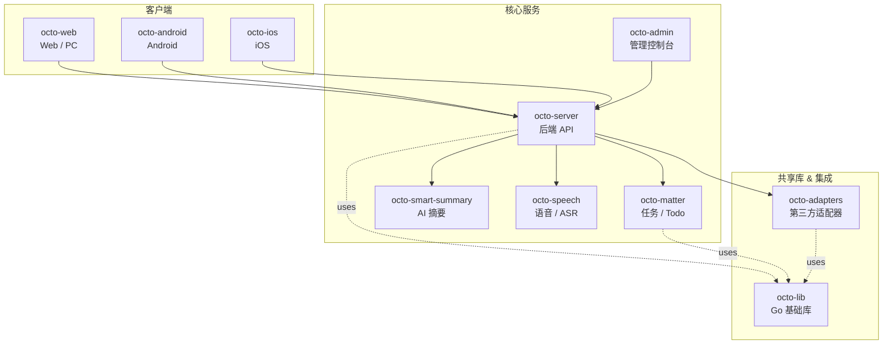

<p align="center">
  <b>octo-speech — OCTO 智能语音转文字微服务</b>
</p>

<p align="center">
  <a href="https://github.com/Mininglamp-OSS"><b>🏠 OCTO 主页</b></a> ·
  <a href="#-快速开始"><b>🚀 快速开始</b></a> ·
  <a href="#-octo-生态"><b>📦 生态</b></a> ·
  <a href="./CONTRIBUTING.zh.md"><b>🤝 贡献</b></a>
</p>

<p align="center">
  <a href="./LICENSE"></a>
  <a href="./README.md"></a>
</p>

---

> 🌐 **阅读语言**: [English](README.md) · **简体中文**

# octo-speech

> **OCTO 多引擎 ASR 微服务** — 上下文感知语音转写、词汇表管理，以及独立的管理控制台。可作为一等语音输入层无缝接入任意 OCTO 部署。

`octo-speech` 为 OCTO 平台提供语音转文字能力，支持多个大模型驱动的 ASR 引擎（Gemini、GPT、Qwen）并具备自动故障转移，提供按用户/空间/组织粒度的词汇纠错档案，以及独立的管理服务用于应用和 API Key 生命周期管理。

## 🌟 为什么选择 octo-speech

- **引擎无关。** Gemini、GPT、Qwen 多后端自动故障转移 —— 更换或新增引擎无需改动调用方。
- **上下文感知纠错。** 词汇档案按用户、空间、组织分层生效，让原始转写结果准确匹配业务领域术语。
- **零明文密钥暴露。** API Key 以 SHA-256 哈希存储，明文仅在创建时显示一次，永不持久化。
- **独立管理面。** 专用管理服务（8781 端口）负责应用 CRUD 和 Key 管理，与转写路径完全隔离。
- **安全优先默认值。** JWT 使用 httpOnly + SameSite=Strict Cookie、CSRF 双提交、登录限流、非 root 容器运行时。

## 🚀 快速开始

### 前置要求

- Docker & Docker Compose
- MySQL 8.0+

### 1. 克隆

```bash
git clone https://github.com/Mininglamp-OSS/octo-speech.git
cd octo-speech
```

### 2. 配置

创建 `.env` 文件：

```env
# MySQL
MYSQL_ROOT_PASSWORD=your_password

# 语音服务
SPEECH_DB_DSN=root:your_password@tcp(mysql:3306)/octo_speech?parseTime=true&loc=Asia%2FShanghai
VOICE_LITELLM_URL=https://your-llm-gateway/v1
VOICE_LITELLM_KEY=sk-xxx
VOICE_ENGINE=gemini

# 管理服务
ADMIN_USERNAME=admin
ADMIN_PASSWORD=your_admin_password
ADMIN_JWT_SECRET=your_secret_here
ADMIN_SECURE_COOKIE=false   # HTTPS 环境下设为 true
```

### 3. 部署

```bash
# 构建镜像
docker build -t octo-speech:latest .
docker build -f Dockerfile.admin -t octo-speech-admin:latest .

# 启动
docker compose up -d
```

### 4. 创建第一个应用

打开 `http://localhost:8781` → 登录 → 创建应用 → 复制 API Key（仅显示一次）。

### 本地开发

```bash
# 运行测试
go test ./...

# 编译二进制
go build -o speech ./cmd/speech
go build -o admin ./cmd/admin

# 运行语音服务
SPEECH_DB_DSN="root:pass@tcp(localhost:3306)/octo_speech?parseTime=true" \
VOICE_LITELLM_URL="http://localhost:4000/v1" \
VOICE_LITELLM_KEY="sk-xxx" \
./speech

# 运行管理服务
SPEECH_DB_DSN="root:pass@tcp(localhost:3306)/octo_speech?parseTime=true" \
ADMIN_USERNAME=admin \
ADMIN_PASSWORD=dev123 \
ADMIN_SECURE_COOKIE=false \
./admin
```

## 📐 架构

两个独立服务共享同一个 MySQL 数据库：

```
┌─────────────────┐     ┌─────────────────┐
│  octo-speech    │     │  octo-speech    │
│  （语音 API）    │     │  （管理控制台）  │
│  :8780          │     │  :8781          │
└────────┬────────┘     └────────┬────────┘
         │                       │
         └───────────┬───────────┘
                     │
              ┌──────┴──────┐
              │    MySQL    │
              └─────────────┘
```

| 服务 | 端口 | 职责 |
|------|------|------|
| **speech** | 8780 | 转写 API、词汇表管理、配置查询 |
| **admin** | 8781 | 应用 CRUD、API Key 管理、Web UI |

## 🎙️ 语音 API

所有端点需要 `Authorization: Bearer <api_key>`。

### POST /v1/speech/transcribe

带上下文感知纠错的音频转写。

```bash
curl -X POST http://localhost:8780/v1/speech/transcribe \
  -H "Authorization: Bearer sk-xxx" \
  -F "audio=@recording.wav" \
  -F "context_text=上一条消息文本" \
  -F "engine=gemini"
```

**参数说明：**

| 字段 | 类型 | 说明 |
|------|------|------|
| `audio` | file | 音频文件（最大 5 MB） |
| `context_text` | string | 用于编辑模式纠错的前文 |
| `chat_context` | string | 最近聊天消息，提升上下文准确性 |
| `personal_context` | string | 用户个人词汇纠错档案 |
| `member_context` | string | 群组成员名单，辅助人名识别 |
| `engine` | string | `gemini` / `gpt` / `qwen` |
| `model` | string | 指定模型覆盖默认值 |
| `mode` | string | `smart` / `append_only` / `edit_only` |
| `channel_type` | string | `dm` / `group` |

### GET /v1/speech/config

返回服务配置（引擎、限制、本地 ASR 设置）。

### PUT /v1/speech/vocabularies

创建或更新词汇纠错档案。

### GET /v1/speech/vocabularies

按作用域优先级获取词汇档案。

### DELETE /v1/speech/vocabularies

删除词汇档案。

## 🛠️ 管理 API

管理服务运行在 8781 端口，使用 JWT Cookie 认证。

| 方法 | 端点 | 说明 |
|------|------|------|
| POST | `/api/login` | 登录（设置 httpOnly Cookie） |
| POST | `/api/logout` | 登出（清除 Cookie） |
| GET | `/api/apps` | 列出所有应用 |
| POST | `/api/apps` | 创建应用（仅返回一次 Key） |
| PUT | `/api/apps/:id/status` | 启用 / 禁用应用 |
| DELETE | `/api/apps/:id` | 删除应用及关联数据 |
| POST | `/api/apps/:id/reset-key` | 重置 API Key |
| GET | `/healthz` | 健康检查 |

## ⚙️ 配置参考

### 语音服务环境变量

| 变量 | 默认值 | 说明 |
|------|--------|------|
| `SPEECH_DB_DSN` | — | MySQL 连接字符串（**必填**） |
| `SPEECH_SERVICE_PORT` | `8780` | 监听端口 |
| `SPEECH_APP_CACHE_TTL` | `60` | 认证缓存 TTL（秒） |
| `VOICE_LITELLM_URL` | — | LLM 网关 URL（**必填**） |
| `VOICE_LITELLM_KEY` | — | LLM 网关 API Key（**必填**） |
| `VOICE_ENGINE` | `gemini` | 默认引擎：`gemini` / `gpt` / `qwen` |
| `VOICE_MODELS` | `gemini-3.1-pro-preview,...` | Gemini 模型列表 |
| `VOICE_GPT_MODELS` | `gpt-4o-mini-transcribe` | GPT 模型列表 |
| `VOICE_QWEN_MODELS` | `qwen3.5-omni-plus` | Qwen 模型列表 |
| `VOICE_MAX_DURATION` | `60` | 最大音频时长（秒） |
| `VOICE_MAX_FILE_SIZE` | `3145728` | 最大上传大小（字节，约 3 MB） |
| `SPEECH_READ_TIMEOUT` | `30` | HTTP 读超时（秒） |
| `SPEECH_WRITE_TIMEOUT` | `60` | HTTP 写超时（秒） |
| `SPEECH_IDLE_TIMEOUT` | `120` | HTTP 空闲超时（秒） |

### 管理服务环境变量

| 变量 | 默认值 | 说明 |
|------|--------|------|
| `SPEECH_DB_DSN` | — | MySQL 连接字符串（**必填**） |
| `ADMIN_PORT` | `8781` | 监听端口 |
| `ADMIN_USERNAME` | — | 登录用户名（**必填**） |
| `ADMIN_PASSWORD` | — | 登录密码（**必填**） |
| `ADMIN_JWT_SECRET` | 随机值 | JWT 签名密钥（生产环境必须指定） |
| `ADMIN_TOKEN_EXPIRE` | `24` | JWT 有效期（小时） |
| `ADMIN_SECURE_COOKIE` | `true` | 要求 HTTPS Cookie |
| `ADMIN_TRUSTED_PROXIES` | — | 限流可信代理 IP 列表 |

## 🔒 安全机制

- API Key 以 SHA-256 哈希存储 —— 数据库泄露不会暴露明文 Key
- 管理员密码启动时 bcrypt 哈希 —— 明文永不驻留内存
- JWT 使用 httpOnly + SameSite=Strict Cookie —— XSS 防护
- 所有变更端点实施 CSRF 双提交 Cookie 校验
- 登录限流（5 次/分钟/IP），支持可信代理配置
- 非 root 容器运行时（UID 10001）
- 可配置 HTTP 超时（防 Slowloris 攻击）
- 分段解析前强制请求体大小限制
- 模型参数白名单校验

## 🔗 OCTO 生态

<!-- shared snippet: OCTO repo matrix. Keep identical across all repos. -->



| 仓库 | 语言 | 职责 |
|------|------|------|
| [`octo-server`](https://github.com/Mininglamp-OSS/octo-server) | Go | 后端 API · 业务编排 · Lobster Agent 调度 |
| [`octo-matter`](https://github.com/Mininglamp-OSS/octo-matter) | Go | 任务 / Todo / Matter 微服务 |
| [`octo-smart-summary`](https://github.com/Mininglamp-OSS/octo-smart-summary) | Go | LLM 驱动的会话摘要 |
| [`octo-speech`](https://github.com/Mininglamp-OSS/octo-speech) | Go | 多引擎 ASR · 词汇纠错 · 管理控制台 |
| [`octo-web`](https://github.com/Mininglamp-OSS/octo-web) | TypeScript / React | Web & PC（Electron）客户端 |
| [`octo-android`](https://github.com/Mininglamp-OSS/octo-android) | Kotlin / Java | 原生 Android 客户端 |
| [`octo-ios`](https://github.com/Mininglamp-OSS/octo-ios) | Swift / Objective-C | 原生 iOS 客户端 |
| [`octo-admin`](https://github.com/Mininglamp-OSS/octo-admin) | TypeScript / React | 管理控制台（租户 / 组织 / 用户 / 频道管理） |
| [`octo-lib`](https://github.com/Mininglamp-OSS/octo-lib) | Go | 共享基础库（协议、加密、存储、HTTP） |
| [`octo-adapters`](https://github.com/Mininglamp-OSS/octo-adapters) | TypeScript / Python | 第三方集成（IM 桥、AI 频道） |

## 🧭 工程哲学

OCTO 所有仓库共享三条原则：

1. **本地优先。** 能在用户自己机器上运行的 —— 转写、嵌入、Agent —— 就跑在本地。数据主权属于你；云端是选择，不是强制。
2. **人做判断，AI 思考执行。** 人专注于 *品味*（什么重要、什么对、发什么版本）。Lobster Agent —— OpenClaw 驱动的数字分身 —— 承担 *思考* 和 *执行* 的工作量。
3. **以产品标准发布。** 每次开源发布都是自洽的完整产品，而非代码堆积：Apache 2.0，无内部包袱，仅从本仓库即可完整复现。

## 🤝 参与贡献

欢迎 Pull Request！开 PR 前请先阅读：

- [CONTRIBUTING.zh.md](CONTRIBUTING.zh.md) — 工作流、分支模型、提交规范
- [CODE_OF_CONDUCT.zh.md](CODE_OF_CONDUCT.zh.md) — 社区行为准则

安全漏洞请遵循 [SECURITY.zh.md](SECURITY.zh.md) 而非公开 Issue 追踪。

## 📄 许可证

Apache License 2.0 —— 完整协议文本见 [LICENSE](LICENSE)，第三方依赖归因见 [NOTICE](NOTICE)。

---

<p align="center">
  <sub>Made with 🐙 by <b>OCTO Contributors</b> · <a href="https://github.com/Mininglamp-OSS">Mininglamp-OSS</a></sub>
</p>
